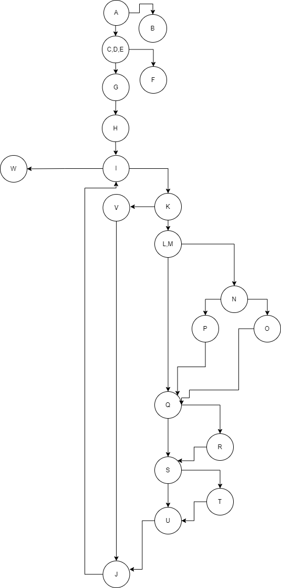

 Јана Ристовска 203186

**Control Flow Graph**

**Тест случаи според критериумот Every statement**

Првиот тест случај е кога на функцијата се праќа празна листа, така што се минуваат А и В јазлите. 
Вториот тест случај( **["0", "#", "0", "#", "0", "#", "#", "0"]** ) е кога на функцијата се праќа листа од 8 елементи (не го исполнува условот од јазел Е), и се поминуваат А, C, D, E и F јазлите. 
Третиот тест случај ( **["0", "#", "0", "#", "0", "#", "#", "0", "#"]**  ) е пратена листа, чии елементи ги минуваат сите јазли од графот.  
Тест случаите ги тестирав со brakepoints поставени на сите јазли, и со дебагирање. 

**Тест случаи според критериумот Every path**
